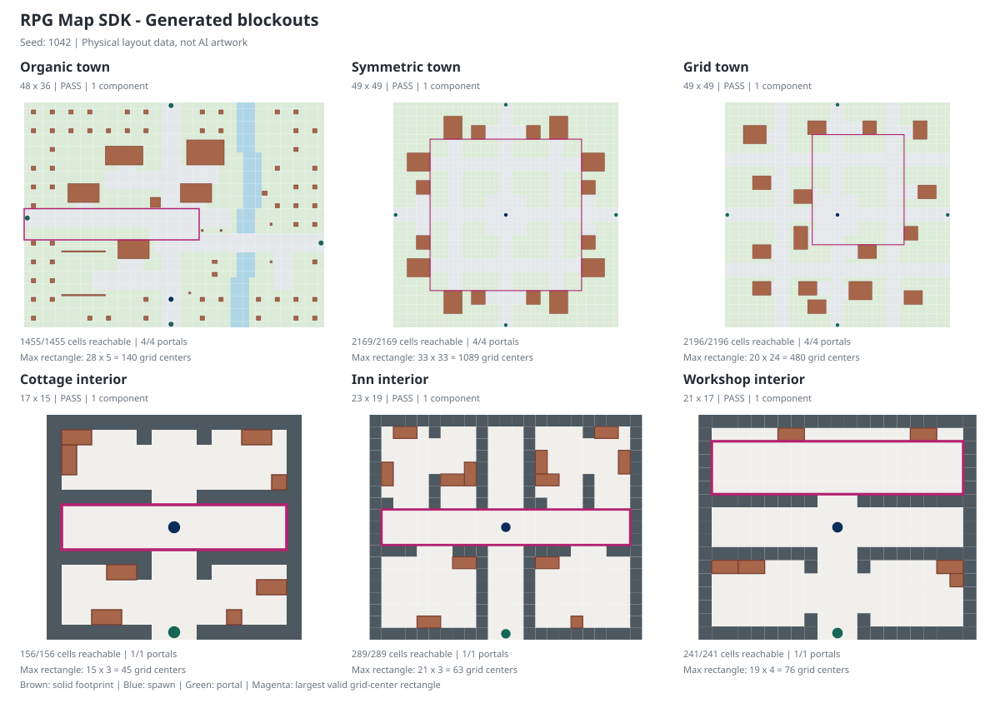

# RPG Map Skill + SDK

先把地图做得能走，再让 AI 把它画得好看。

Blockout-first RPG maps: deterministic layouts, verified navigation, and art
plans that cannot silently change collision. Includes installable agent skills
and a renderer-independent JavaScript / TypeScript SDK.



## 包含什么

- **地图制作 Skill**：布局约束、算法验证、分层素材、Agent 协作与验收。
- **地图 SDK**：散落村镇、对称城镇、网格城镇，以及住宅、旅店、工坊室内。
- **四向出口与内外关联**：出口、房屋门口、家具交互点都要通过真实角色净空验证。
- **美术计划**：Blob 邻接掩码、距离场、保护区、地面贴花与接触阴影数据。
- **可运行示例**：切换六种预设，查看碰撞框、最大可走矩形和点击寻路，下载 JSON。
- **可选原声视频 Skill**：不改原稿和录音，用 GSAP 时间轴细化运镜、转场与音效。

这不是“一键完成所有 RPG”的引擎，也不附带私有游戏、AI 图片、录音或视频。

## 快速开始

制作工具使用 Node.js 22 或更新版本。SDK 本身声明兼容 Node.js 18+，不依赖浏览器、React、API key 或网络。

```sh
git clone https://github.com/laid-backprogrammer/rpg-map-skill-sdk.git
cd rpg-map-skill-sdk
npm ci
npm test
npm run check:types
npm run examples
npm run demo
```

示例地址以启动输出为准。只监听本机；如果默认端口被占用，指定其他端口：

```sh
npm run demo -- --port 5188
```

生成四出口城镇和室内：

```sh
npm run generate -- --layout symmetric --width 49 --height 49 --walls --out output/city.json --art-out output/city-art.json
npm run generate -- --kind interior --template inn --symmetry quadrilateral --out output/inn.json
npm run validate -- --input output/city.json
```

## 在游戏中使用 SDK

克隆后可以安装 `packages/map-sdk`，或先运行 `npm run sdk:pack`，把 `output/mossbrook-map-sdk-0.3.0.tgz` 安装到目标工程：

```sh
npm install /path/to/mossbrook-map-sdk-0.3.0.tgz
```

也可以从 [GitHub Release](https://github.com/laid-backprogrammer/rpg-map-skill-sdk/releases) 下载同名安装包。**尚未发布 npm 注册表**，不要直接假设 `npm install @mossbrook/map-sdk` 可以联网安装。

```js
import { createMapSDK, createArtPlan, findPath } from "@mossbrook/map-sdk";

const sdk = createMapSDK({ seed: "my-prologue" });
const town = sdk.generateTown({
  layout: "symmetric", width: 49, height: 49, perimeterWalls: true,
});
const room = sdk.generateBuildingInterior(town, town.buildings[0].id);
const art = createArtPlan(town, { preset: "generic" });
const route = findPath(town, town.spawn, town.exits[0]);

console.log(town.report.passed, room.connections, route.length);
console.log(art.statistics.collisionChanges); // 0
```

完整参数、坐标和输出约定见 [SDK 文档](packages/map-sdk/README.md)。

## 安装 Skill

将 `skills/rpg-map-workflow` 文件夹放入你的 Agent 的 skills 目录。Codex 的默认位置是 `~/.codex/skills/`；其他 Agent 请使用其对应的 skill 安装方式。

也可从 [GitHub Release](https://github.com/laid-backprogrammer/rpg-map-skill-sdk/releases) 下载独立 Skill ZIP，解压后保留整个同名文件夹（包括 `LICENSE` 和 `references`）。

给支持 Skill 的 Agent 一个实际请求：

```text
使用 $rpg-map-workflow，为我的 2D RPG 生成四出口对称新手城镇。
先生成 blockout 和验证报告，再给底图、实体和动画素材规划。
保持门口、碰撞和可走通道不被 AI 图片改变。
```

`skills/rpg-original-voice-video` 是独立可选技能，地图生成不依赖它。
使用 Codex 的 `$skill-installer` 也可以指定本仓库与 `skills/rpg-map-workflow` 路径安装。

## 制作流程

```text
需求与故事节点
    -> Blockout + 物理占地 + 门口/道路保护
    -> 连通分量 + A* + 连续移动净空验证
    -> 冻结布局 + 导出素材合同
    -> 受布局约束的 AI 地表 / 独立实体 / 动作帧
    -> 地表、贴花阴影、脚点实体、前景、特效
    -> 游戏实机与自动化复验
```

[完整流程](docs/workflow.md) · [素材和动作合同](docs/asset-contract.md) · [原声视频流程](docs/video-workflow.md)

## 已实现与边界

| 项目 | 当前范围 |
| --- | --- |
| 散落村镇 | `organic` 固定 48×36、五栋房屋；不是任意规模村镇求解器 |
| 对称城镇 | 奇数尺寸；方形保持 D4 结构对称，矩形保持 X/Y 镜像；四个边界出口 |
| 室内 | 三种模板、镜像模式、家具和门户关联；当前不是 WFC |
| 最大矩形 | 栅格中心容量参考；不是房屋打包或连续无障碍区域的证明 |
| 寻路 | PathFinding.js 的 A*，连通验证和沿边圆形角色碰撞检查 |
| 美术 | 输出数据，不生成图片或实现引擎的脚点排序/遮挡透明化 |
| 泊松配景 | 当前完整簇配景只在 `fangcun` + `sceneId:"courtyard"` 专用场景启用；`generic/plain` 不新增大型配景 |
| AI / 视频 | 外部可选工具；不自带供应商、密钥、GSAP 或 HyperFrames 运行时 |

不能用本仓库推出“零 Bug”“任意地图必定可玩”或具体 token 节省比例。遇到不可满足的参数会明确失败，外部编辑后要重建导航并复验。

## 验证与打包

```sh
npm test
npm run check:types
npm run check:release
npm run demo:build
npm run sdk:pack
npm run test:package
```

CI 在 Linux / Windows 和 Node.js 22 / 24 上运行同一套测试、类型检查、发布内容检查和安装包消费测试。`output/`、依赖、凭据与私人媒体均不入库。

## License

本项目原创代码和文档使用 [MIT](LICENSE)。第三方依赖、可选工具和素材不被改授权为 MIT，见 [Third-Party Notices](THIRD_PARTY_NOTICES.md)。
